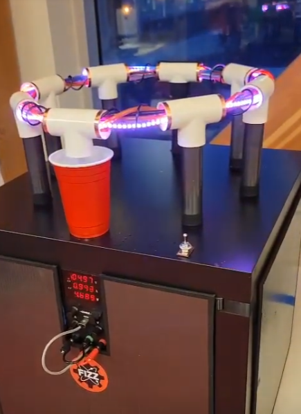

# fizz_particle_accelerator
[personal project] a "ball model" made for the 2022-2023 UBC e-week competition. the goal was to build something that can serve alcohol discretely, and is related to my engineering faculty (engineering physics)

There was no cad or schematic or anything for this, i can't even find my arduino code anymore. I built this in a week, partially drunk. the dean of engineering liked it. It used some submersible pumps driven with relays, controlled with an RP2040. the lights are WS2812b LEDs and are just programmed with an animation that makes the illusion of it moving really fast, which was actually kind of cleverly done but idk where the code is :)

[here's a video!](https://youtu.be/WJqjtxKX_-M)  

